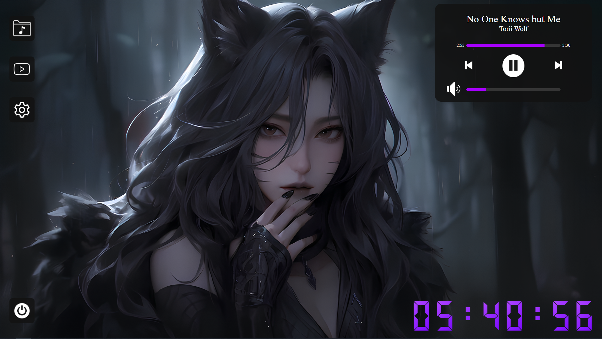
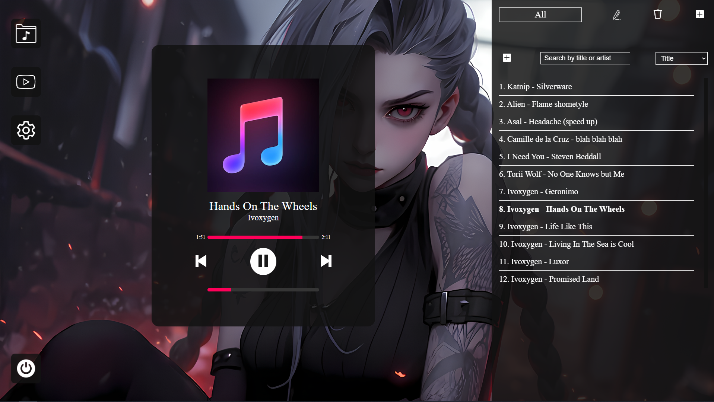
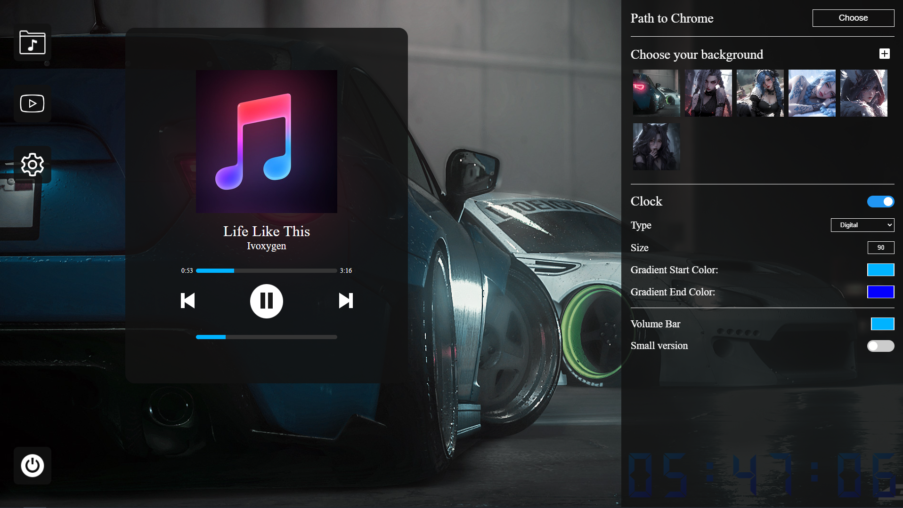

# Melomaniac

Melomaniac is a desktop music player with the ability to download music from YouTube. This application provides users with an intuitive interface for managing playlists, playing music, and downloading tracks directly from YouTube.

📄 **[Read this in Ukrainian / Читати українською](READMEua.md)**


📄 **[Hotkeys](Hotkeys.md)**

## Features
- **Music Playback:** The player supports the playback of music files added to playlists.
- **YouTube Downloads:** Download music from YouTube by inserting the video link.
- **Playlist Management:** Create, rename, and delete playlists to organize your music files conveniently.
- **Customization:** Extensive customization options allow users to adjust the appearance and functionality of the player to their preferences.

## Installation and Launch
1. **Download:** Download the latest version of the application [Melomaniac.rar](https://github.com/yuriiavr/desctop-player/releases/download/Melomaniac/Melomaniac.1.2.0.rar).
2. **Installation:** Extract "Melomaniac.rar" and install the application by opening "Melomaniac Setup 1.2.0.exe".
3. **Launch:** Navigate to the folder where you installed the player and open Melomaniac.exe, or use the desktop shortcut.

## How to Download Music from YouTube
- **Set Chrome Path:** In the player's interface, open the settings. Specify the path to Chrome, e.g., `C:/Program Files/Google/Chrome/Application/chrome.exe`.
- **Download:** In the player's interface, go to the YouTube tab. Paste the desired link and click Download. The song will appear in the "Downloads" folder on your PC. Note that the player is optimized for downloading songs! It is recommended not to download hour-long playlists or videos.

## System Requirements
- **Operating System:** Windows 7 or later.
- **Node.js:** Required for running in development mode.

## Developer Commands
- **Run in Development Mode:**
  ```bash
  npm run dev

## Technologies Used
- **Electron**: For building a cross-platform desktop application.
- **Puppeteer**: For automating music downloads from YouTube.
- **Electron Builder**: For packaging and preparing the application distribution.

## Common Issues
- **Icon Does Not Appear:** Ensure the `icon.ico` file is in the correct format and includes multiple image sizes (16x16, 32x32, 48x48, 256x256).
- **Access Rights Issues:** Try running the build command with administrative rights.
- **YouTube Download Fails:** Refer to the download instructions above!

## License
This project is licensed under the [MIT License](LICENSE).

## Feedback
If you have suggestions or questions, please open an issue on [GitHub](https://github.com/username/myPlayer/issues).


## Player Examples


